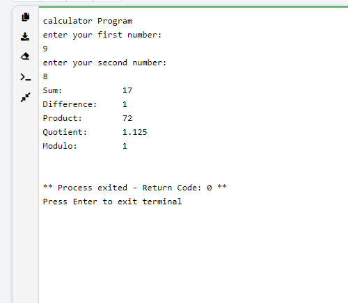
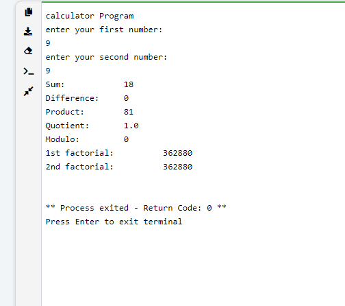
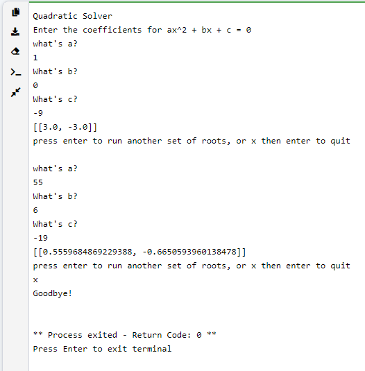
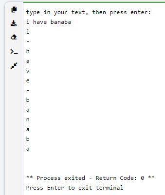

# Engineering_4_Notebook
Engineering Notebook for 2021-22 school year

windows+shift+'s' to screenshot


I didn't ask you to document hello_world.py or dice_roller.py. I'll start off with an example for dice_roller.py, and then you will reflect on calculator.py.

## Table of Contents
* [Basics](#Basics)
* [Python_Dice_Roller](#PythonDiceRoller)
* [Python_Calculator](#Python_Calculator)
* [Quadratic_Solver](#Quadratic_Solver)
* [Strings_and_Loops](#Strings_and_Loops)
---

## Basics
You can delete this section from your own personal readme. 

### Assignment Description

Write your assignment description here. It should be at least a few sentences.

### Evidence 

Pictures / Gifs of your work should go here.  You need to communicate what your thing does. For code only assignments like the Python calculator, include a screenshot of the output of the code.

### Wiring

This may not be applicable to all assignments. Anything where you wire something up, include the wiring diagram here.

### Reflection

What went wrong / was challenging, how'd you figure it out, and what did you learn from that experience?  Your ultimate goal for the reflection is to pass on knowledge that will make this assignment better or easier for the next person. Think about your audience for this one, which may be "future you" (when you realize you need some of this code in three months), me, or your college admission committee!

** Don't forget to **COMMENT YOUR CODE** before you upload to Github!

## Python_Dice_Roller

Okay so I am giving you a freebie so you have an example of the kind of reflections that I want. I'll start you off with an example for dice_roller.py, then its up to you to start your reflections with the Python calculator and all subsequent assignments. You can delete this section from your personal readme. 

### Assignment Description

The purpose of this assignment was to create a program that can automatically roll dice. The program also took user input to decide whether another dice should be rolled, or if the program should exit. The spicy version added complexity by asking the user to specify the number of sides on the dice and the number of dice to be rolled at a time. The user was then asked whether they wanted to roll again with the same settings, change the settings, or exit the program. 

### Evidence 

Vanilla version:


Spicy version:


### Wiring

N/A

### Reflection

This assignment was relatively simple, but was challenging because I had not coded in Python for several months. I learned that I could import parts of toolboxes without importing the entire thing, but that changes the syntax of how I call the function later. I also learned about using a while loop to control whether a user wants to exit the program. For the spicy version, I needed to use nested loops. Python determines what is inside a loop by the indent level of each line of text, rather than brackets like some other coding styles. That means I need to be really careful with my tabs!


## Python_Calculator

### Assignment Description

> Write a python_calculator.py program that gives you the sum, difference, quotient, and modulo of the two numbers.  The program asks the user for two numbers and then runs them through one function, five different times.  The last five lines of the program should look something like this:
> 
> ```python3
> print("Sum:\t\t" + doMath(a,b,1))
> print("Difference:\t" + doMath(a,b,2))
> print("Product:\t" + doMath(a,b,3))
> print("Quotient:\t" + doMath(a,b,4))
> print("Modulo:\t\t" + doMath(a,b,5))
> ```

### Evidence 
Vanilla version:

[](Python/automatic_dice_roller.py)

Spicy version:

[](Python/automatic_dice_roller_spicy.py)

### Wiring
N/A

### Reflection

Had a very easy time figuring this out. Had to end up commenting my code later on.

## Quadratic_Solver

### Assignment Description

> Requirements for the program.  Read carefully:
> 
> The program sends the three coefficients to a function 
> The function calculates the discriminant for the quadratic
> If the discriminant is negative, the user gets a message that there are no real roots
> If the discriminant is zero or positive, the function returns an array of the two roots.  The program then prints the two roots.  This occurs outside of the function.
> After the roots are displayed, ask the user if they want to run another set of roots, or if they want to quit (this is similar to your previous assignment -- reuse that code!)

### Evidence 

[](Python/quadratic_solver.py)

### Wiring

N/A

### Reflection

Had to remind myself how lists work in python. Just used a barebones approach to them, and i'll remember more about it later. I also had a problem where the variables were strings instead of integers. Just had to convert the inputs to ints using `int()`.

## Strings_and_Loops 

### Assignment Description

> Write a program that asks the user to type a simple sentence.  The program then takes that sentence and splits it (using the split() function) into an array of words.  The program then loops through that array of words using a for loop.  For each word, the program then loops through the letters in the word (another for loop) and prints them to the screen.  At the end of each word, the program prints a minus sign.
> 
> Spicy Version (Optional):
> No additional requirements, but try to collapse your code into as few lines as possible (other than commented intro lines). You probably want to get your code working first, then look for ways to combine lines where possible. Mr. Miller's code is 4 lines long. Try to tie or beat that!
> 
> Note: Writing code into as few lines as possible isn't always good for code readability. In real life, you want to find a balance between being concise but understandable for other coders. For now though, this is a good challenge!

### Evidence 

[](Python/strings_and_loops_spicy.py)

### Wiring

N/A

### Reflection

More review. I just stole the concept for my code from [W3schools](https://www.w3schools.com/python/trypython.asp?filename=demo_for_string). It's crazy to me that it works like that, but idk if that concept works for all arrays. I didn't use split because I found that it would be extremely clunky.
