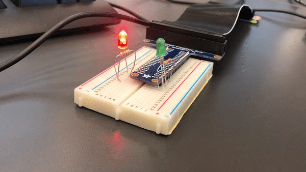
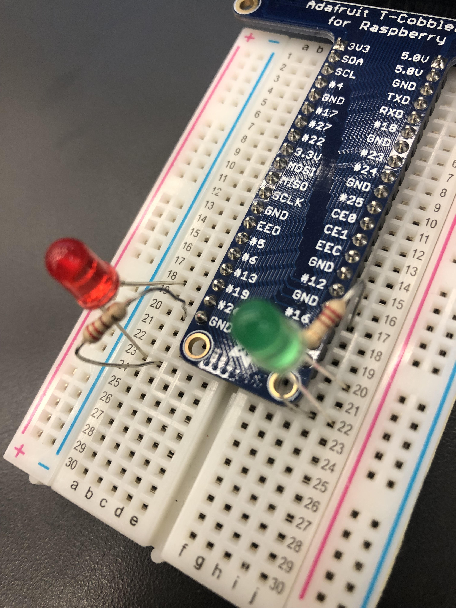
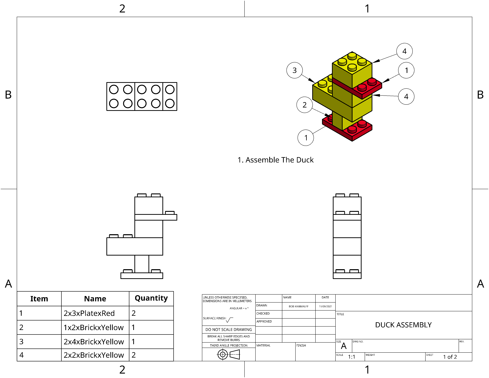
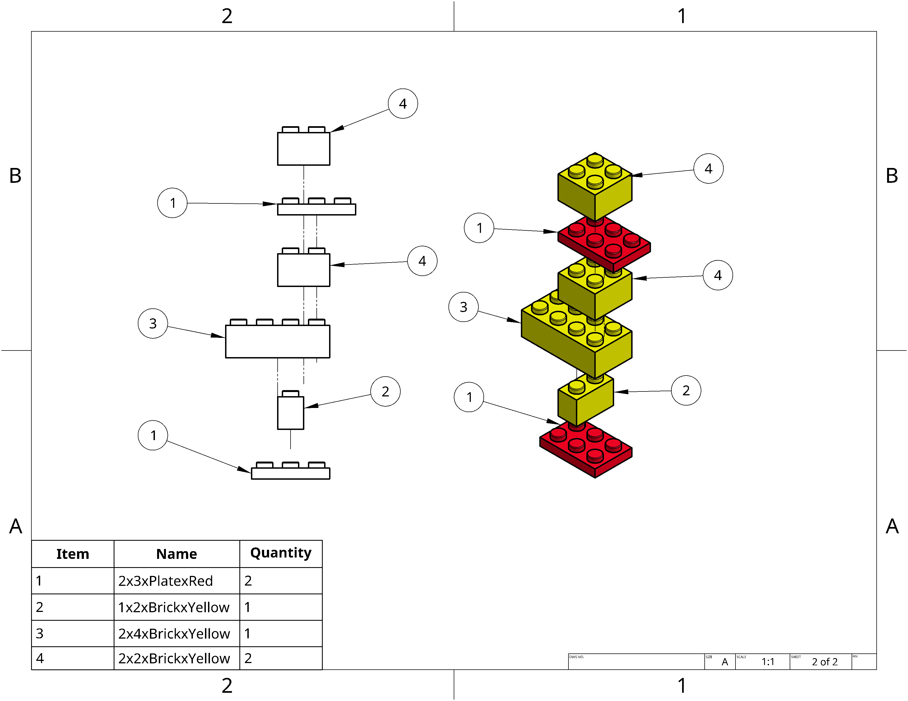

# Engineering_4_Notebook
Engineering Notebook for 2021-22 school year
<details>
  
  windows+shift+'s' to screenshot
  
  
  
  I didn't ask you to document hello_world.py or dice_roller.py. I'll start off with an example for dice_roller.py, and then you will reflect on calculator.py.

</details>
  
## Table of Contents
* [Python_Calculator](#Python_Calculator)
* [Quadratic_Solver](#Quadratic_Solver)
* [Strings_and_Loops](#Strings_and_Loops)
* [MSP](#MSP)
* [RPi_GPIO_Pin_Introduction](#RPi_GPIO_Pin_Introduction)
* [CAD](#CAD)
  * [Onshape_Power_Tools](#Onshape_Power_Tools)
---

## Python_Calculator

### Assignment Description

Write a calculator program that gives you the sum, difference, quotient, and modulo of two numbers entered by the user. Code should include the following:

```python3
print("Sum:\t\t" + doMath(a,b,1))
print("Difference:\t" + doMath(a,b,2))
print("Product:\t" + doMath(a,b,3))
print("Quotient:\t" + doMath(a,b,4))
print("Modulo:\t\t" + doMath(a,b,5))
```

Math has to be done within ONE function called `doMath(x, y, z)`

the z value determines what result is returned

the spicy version also gives the factorials of both numbers.

### Evidence 
Vanilla version:

[](Python/calculator.py)

Spicy version:

[](Python/calculator_spicy.py)

### Wiring
N/A

### Reflection

Had a very easy time figuring this out. The function simply returns the result based upon what number is inputted for `z`. Converting the input into an integer is important so that it doesn't crash. I already knew that `%` was the modulo sign. The spicy version returns the factorials of both numbers as well.

## Quadratic_Solver

### Assignment Description

The user inputs three coefficients of a quadratic to a function that calculates the roots for the quadratic, then prints those roots(if there are any).

### Evidence 

[](Python/quadratic_solver.py)

### Wiring

N/A

### Reflection

Had to remind myself how lists work in python. I don't like how it outputs the brackets as well, but it's not a big deal so there's no reason to change it. I also had a problem where the variables were strings instead of integers. Just had to convert the inputs to ints using `int()`.

## Strings_and_Loops 

### Assignment Description

user inputs a simple sentence, and the program takes the sentence and prints it with each letter on a new line. After each word, print a "-"

Spicy Version: Write code in as few lines as possible

### Evidence 

[](Python/strings_and_loops_spicy.py)

### Wiring

N/A

### Reflection

More review. I just stole the concept for my code from [W3schools](https://www.w3schools.com/python/trypython.asp?filename=demo_for_string). It's crazy to me that it works like that, but idk if that concept works for all arrays (future me has come back to say that it doesn't work like I thought it would :/ ) I didn't use `string.split()` like it said to in the assignment description because I found that it was unnessesary, especially for trying to cut down the amount of lines on the code.

## MSP

(Man-Shaped Piñata)

### Assignment Description

Write code for a Hangman Game.

### Evidence 

[Link](Python/MSP.py)

```
Man-Shaped Pinata by Bob Kammauff
Player 1, Enter a word:
www.github.com

...

cleared screen! don't scroll up!
---┐


Missed Guesses: set()
_ _ _ . _ _ _ _ _ _ . _ _ _ 
Player 2, guess a letter: 
w
---┐


Missed Guesses: set()
w w w . _ _ _ _ _ _ . _ _ _ 
Player 2, guess a letter: 
ww
don't guess multiple letters or non-letters thats above my pay grade
---┐


Missed Guesses: set()
w w w . _ _ _ _ _ _ . _ _ _ 
Player 2, guess a letter: 
g
---┐


Missed Guesses: set()
w w w . g _ _ _ _ _ . _ _ _ 
Player 2, guess a letter: 
i
---┐


Missed Guesses: set()
w w w . g i _ _ _ _ . _ _ _ 
Player 2, guess a letter: 
t
---┐


Missed Guesses: set()
w w w . g i t _ _ _ . _ _ _ 
Player 2, guess a letter: 
h
---┐


Missed Guesses: set()
w w w . g i t h _ _ . _ _ _ 
Player 2, guess a letter: 
u
---┐


Missed Guesses: set()
w w w . g i t h u _ . _ _ _ 
Player 2, guess a letter: 
b
---┐


Missed Guesses: set()
w w w . g i t h u b . _ _ _ 
Player 2, guess a letter: 
c
---┐


Missed Guesses: set()
w w w . g i t h u b . c _ _ 
Player 2, guess a letter: 
o
---┐


Missed Guesses: set()
w w w . g i t h u b . c o _ 
Player 2, guess a letter: 
m
---┐


Missed Guesses: set()
w w w . g i t h u b . c o m 
you win!
The correct answer was: www.github.com
press y then enter to play again
```

### Wiring

N/A

### Reflection

Had to learn about all the different types of arrays that python uses and what they're good for. using a set for missed guesses gives it built-in ignoring guesses already made.

I was also having trouble because I accidentaly created an infinite `While` loop and it was causing the IDE to glitch and get stuck after the "guess a letter". It was confusing because it was making simple print functions not output anything, so I was stuck debugging for a while. Thankfully I figured out I forgot to add 1.

## RPi_GPIO_Pin_Introduction

### Assignment Description

Write Code to blink leds on raspberry pi in order to learn how the pi handles GPIO pins.

### Evidence 

[](Python/gpio_led.py)

*click on gif to go to the code*

### Wiring



### Reflection

Had to remember that in this class, our primary educator is google, so I should consult that as often as possible. I was also having a lot of problems with navigating nano in the pi itself. Don't use `ctrl+z` in it, it doesn't work. I still have yet to get copying from the code in nano to work yet. My notes has it as `ctrl+alt` but that doesn't seem right... maybe `ctrl+alt+c`?

`stty columns "# of columns" rows "# of rows"` allows you to tell the pi how big your screen is so that the text doesn't overlap.

## CAD

## Onshape_Power_Tools

### Assignment Description

Playing With Legos! 3D model a lego so that you can use configurations to generate many different types of legos! We used variables to define the amount of rows and column of studs each lego would have, and then used a shell in the design to make them hollow. We then had to use the legos we designed in assemblies to make different lego creations, namely, a duck! We then made an instruction manual on how to assemble the duck.

### Evidence 

[](https://cvilleschools.onshape.com/documents/0cd5fab2f09c50364ab1d1e9/w/fb544f64e8e0a477230acc25/e/81a8228943e6e4ff0aef9016) [](https://cvilleschools.onshape.com/documents/0cd5fab2f09c50364ab1d1e9/w/fb544f64e8e0a477230acc25/e/81a8228943e6e4ff0aef9016)

### Reflection

The different uses for drawings are very cool. We had only ever used them for laser cutting, but using them to create actual Engineering Drawings is pretty cool.
